# Enumy

Enumy is a Linux post exploitation vulnerability scanner that aims to automate as much of the intial post exploitation recon during a CTF or a pentest. Enumy has a nice interface built with ncurses if you have an SSH connection, or a standard text based interface for dumb shells. With an emphisise on portablility and speed.



## Installation

You can download the final binary from the release x86 or x64 tab. _Statically linked to musl_

## Usage

Transfer the final enumy binary to the target machine

## Compilation

To compile during devlopment, make libcap and the ncurses libary is all that is required.

```shell
make
```

To remove the glibc dependency and statically link all libaries/compile with musl do the following. _Note to do this you will have to have docker installed to create the apline build environment._

```shells
./build.sh 64bit
./build.sh 32bit
./build.sh all
cd output
```

## Scans That've Been Implemented

- SUID/GUID scans
- File capabilities
- Interesting files scan
- Coredump scan
- Breakout binary scan


## Optimization

Changing the default number of threads is pretty pointless _unless_  you're running a full scan. A full scan will do a lot more IO so threads greatly increase scan times. For a full scan on my system it took the following times. 

- 195 seconds with 1 threads
- 52 seconds with 4 threads
- 25 seconds with 12 threads